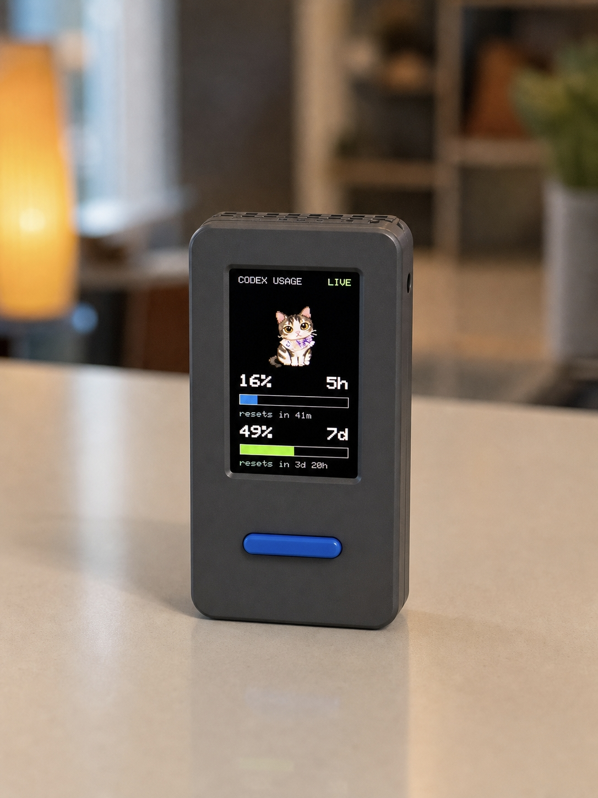

# Codex Usage Stick

Codex Usage Stick is a prototype firmware and local Codex plugin for turning an
M5Stack StickS3 into a small desktop usage monitor.

The StickS3 shows Codex usage over BLE: a GIF pet, a 5-hour usage bar, a 7-day
usage bar, reset countdowns, and live state changes such as `busy`, `idle`,
`completed`, `attention`, `dizzy`, `heart`, and `sleep`.

This project is a personal fork of Anthropic's
[`claude-desktop-buddy`](https://github.com/anthropics/claude-desktop-buddy)
reference firmware. The BLE display idea comes from that reference project,
but this fork is focused on Codex, M5Stack StickS3, GIF pets, and a local Codex
usage bridge.

<p align="center">
  
  
</p>

## What It Displays

- GIF pet area.
- `CODEX USAGE` header with `LIVE` or `WAIT`.
- Primary usage window labeled `5h`.
- Secondary usage window labeled `7d`.
- Reset countdowns for both windows.
- Color-coded usage bars:
  - `0-34%`: blue
  - `35-69%`: green
  - `70-100%`: orange

Portrait mode places the pet above the usage bars. Landscape mode places the
pet on the left and usage bars on the right.

## Hardware

<<<<<<< Updated upstream
The firmware targets ESP32 with the Arduino framework. As written, it
depends on the M5StickCPlus library for its display, IMU, and button
drivers—so you'll need that board, or a fork that swaps those drivers for
your own pin layout.
=======
Tested target:
>>>>>>> Stashed changes

```text
M5Stack StickS3 / ESP32-S3
```

Firmware dependencies are managed by PlatformIO:

- M5Unified
- M5GFX
- AnimatedGIF
- ArduinoJson
- LittleFS
- ESP32 BLE Arduino

## Quick Start

For a full walkthrough, use [docs/USAGE.md](docs/USAGE.md).

### 1. Build And Flash Firmware

```bash
git clone https://github.com/openelab-commits/claude-desktop-buddy-GIF.git
cd claude-desktop-buddy-GIF
pio run -e m5stack-sticks3
pio run -e m5stack-sticks3 -t upload
```

### 2. Upload A GIF Character Pack

PlatformIO uploads LittleFS data from `data/`. This folder is ignored by git so
you can freely swap local pets.

To upload the included `Mao` character:

```bash
rm -rf data
mkdir -p data/characters/Mao
cp -R characters/Mao/* data/characters/Mao/
pio run -e m5stack-sticks3 -t uploadfs
```

To upload your own pet folder:

```bash
rm -rf data
mkdir -p data/characters/MyPet
cp -R /path/to/MyPet/* data/characters/MyPet/
pio run -e m5stack-sticks3 -t uploadfs
```

Keep only one character folder under `data/characters/` when testing. The
firmware loads the first character directory it finds.

### 3. Install The Codex Plugin

Install Python BLE support:

```bash
python3 -m pip install bleak
```

In Codex, open:

```text
Settings -> Plugins -> Add plugin marketplace
```

Fill the dialog like this:

```text
Source:
openelab-commits/claude-desktop-buddy-GIF

Git ref:
main

Sparse path:
leave empty
```

If you publish this under your own fork, use your own GitHub `owner/repo` in
the `Source` field.

Enable plugin hooks:

```bash
/Applications/Codex.app/Contents/Resources/codex features enable plugin_hooks
```

CLI fallback:

```bash
/Applications/Codex.app/Contents/Resources/codex plugin marketplace add openelab-commits/claude-desktop-buddy-GIF --ref main
```

If the plugin does not enable automatically, add this to `~/.codex/config.toml`:

```toml
[plugins."codex-usage-stick@codex-usage-stick-marketplace"]
enabled = true
```

Restart Codex. When Codex asks whether to trust the hook, approve it. The hook
starts a local BLE bridge; it does not send data to an external server.

The plugin also includes Codex skills for status/troubleshooting and seven-state
pet spritesheet generation. They are installed with the plugin; no separate skill
installation is required.
You can ask Codex to check the Codex Usage Stick bridge status after the plugin
is enabled.

### 4. Trigger The Bridge

After Codex restarts, submit any prompt. The plugin hook should start the BLE
bridge automatically.

Check hook startup:

```bash
tail -n 20 ~/.codex/codex-usage-bridge/hook.log
```

You should see `UserPromptSubmit`.

Check BLE packets:

```bash
tail -n 40 ~/.codex/codex-usage-bridge/bridge.log
```

A healthy log contains lines like:

```text
sent {"state":"busy","tokens":...,"primary":...,"secondary":...}
```

## Current Status

This is a working prototype.

Tested:

- M5Stack StickS3 firmware build and upload.
- BLE advertising as `Codex-XXXX`.
- Codex usage packets sent from macOS to StickS3.
- Portrait usage dashboard.
- Landscape usage dashboard.
- Landscape GIF rendering through a small canvas to avoid slow direct LCD
  pixel drawing.
- Local Codex plugin startup on `SessionStart` and `UserPromptSubmit`.
- Hook diagnostics and bridge diagnostics.

Not included yet:

- Real Codex approval/deny handling from the StickS3 buttons. The display
  bridge is the supported path in this version.
- A polished public pet-generation pipeline. GIF pet creation is still a work
  in progress.

## Packet Format

The bridge sends compact JSON over BLE:

```json
{
  "state": "busy",
  "tokens": 57832,
  "primary": 1,
  "secondary": 16,
  "primary_resets_at": 1778673005,
  "secondary_resets_at": 1779159360,
  "now": 1778671200
}
```

| Field | Meaning |
| --- | --- |
| `state` | Pet state: `busy`, `idle`, `completed`, `attention`, `dizzy`, `heart`, or `sleep` |
| `tokens` | Total token usage value read by the bridge |
| `primary` | 5-hour usage percentage |
| `secondary` | 7-day usage percentage |
| `primary_resets_at` | Unix timestamp for primary reset |
| `secondary_resets_at` | Unix timestamp for secondary reset |
| `now` | Sender timestamp |

## GIF Character Pack Format

A character pack is a folder containing `manifest.json` and GIF files.

Example:

```json
{
  "name": "Mao",
  "states": {
    "sleep": "sleep.gif",
    "idle": ["idle_0.gif", "idle_1.gif"],
    "busy": "busy.gif",
    "attention": "attention.gif",
    "completed": "completed.gif",
    "celebrate": "celebrate.gif",
    "dizzy": "dizzy.gif",
    "heart": "heart.gif"
  }
}
```

Recommended source animation target:

- 144x156 frames.
- Transparent background.
- Consistent character design across all states.
- No text, UI elements, shadows, or complex scenery inside the GIF.
- Keep the pack small enough for LittleFS.

## Troubleshooting

Use the full guide in [docs/USAGE.md](docs/USAGE.md#troubleshooting).

Common checks:

```bash
python3 plugins/codex-usage-stick/scripts/start_bridge.py --status
tail -n 20 ~/.codex/codex-usage-bridge/hook.log
tail -n 40 ~/.codex/codex-usage-bridge/bridge.log
```

If Codex shows a hook warning about async hooks, update to this version. The
plugin hooks in this repo are synchronous and quickly start a background bridge.

## Credits

Made by OpenELAB Cris.

Forked from the Claude Desktop Buddy reference firmware by Felix Rieseberg and
Anthropic.

## License

This fork keeps the upstream project license. See [LICENSE](LICENSE).
